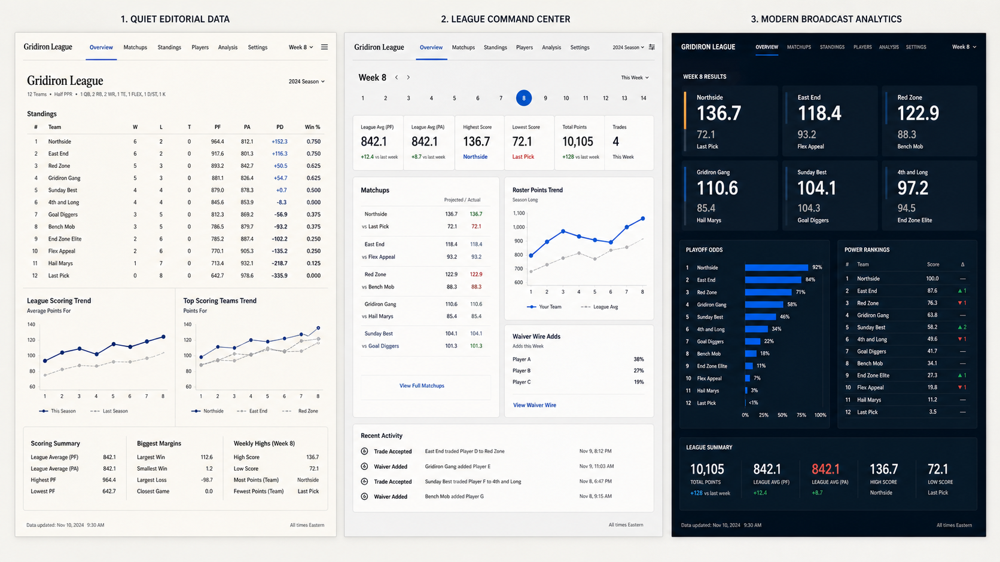
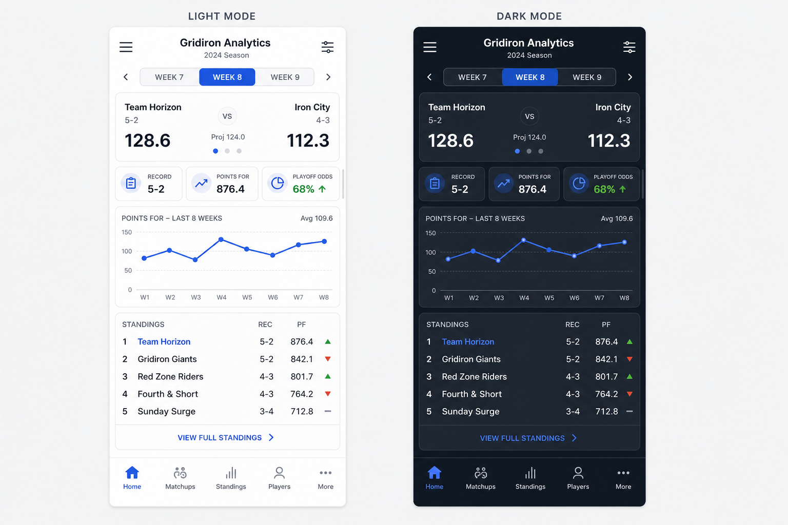

Status: in-progress

# Design-system discovery and direction plan

## Objective

Define a new, intentionally simple UI system for the fantasy-football analytics product before any migration starts. Existing visual design is out of scope as a source of requirements. Product capabilities are retained only to inform the new information architecture and the components the system must support.

## Approved direction

- **Implementation approach:** Option A — token-first Tailwind + app-owned shadcn/ui components + Radix primitives.
- **Visual direction:** Quiet Editorial Data / “Editorial scoreboard.”
- **Responsive direction:** mobile-first, with the approved compact overview and persistent bottom navigation.
- **Themes:** first-class light and dark modes implemented through semantic tokens.

This approval sets the target state; it does not authorize implementation yet.

## Product surface to support

- League overview and historical records
- Teams and head-to-head data
- Schedules and individual matchups
- Players, rankings, and filters
- Transactions, trades, drafts, and simulations
- Administrative data views

The design should make comparison and scanning easy, work well on narrow screens, and support tables, charts, filtering, loading, empty, and error states as first-class patterns.

## Research findings and non-negotiables

- **Token-first foundation.** Use primitive tokens (raw values) and semantic tokens (purpose-based values such as `surface-raised` and `text-muted`). The Design Tokens Community Group's interoperable format gives a future path between design tooling and code without binding the system to one vendor. [DTCG format specification](https://www.w3.org/community/reports/design-tokens/CG-FINAL-format-20251028/)
- **Accessibility is a quality gate, not a polish pass.** Target WCAG 2.2 AA: keyboard access, visible focus, labelled controls, adequate contrast, and usable targets. WCAG 2.2 specifically adds an AA target-size minimum criterion. [W3C WCAG 2.2 update](https://www.w3.org/WAI/standards-guidelines/wcag/new-in-22/)
- **Accessible behavior should be adopted, not recreated.** Menus, dialogs, select-like controls, tabs, and tooltips require managed focus and keyboard interaction. Radix Primitives provide these WAI-ARIA-aligned behaviors while leaving visual design under our control. [Radix Primitives](https://www.radix-ui.com/primitives)
- **Themes must be semantic.** CSS custom properties allow a light/dark theme or future league/brand variants to change semantic values without replacing component class names. This is also the model recommended by shadcn/ui. [shadcn/ui theming](https://ui.shadcn.com/docs/theming)
- **Data visualization needs its own semantics.** Chart series, grid lines, legends, and status colors will be explicit chart tokens; do not use arbitrary component or brand colors as data encodings.

## Viable implementation directions

## Visual direction samples



The selected direction is **Quiet Editorial Data** (the left panel). The center panel remains useful as interaction inspiration for dense dashboard controls; the right panel is retained only as a contrast option.

### Option A — Token-first Tailwind + shadcn/ui + Radix (recommended)

Build the app-owned design system in the existing Next.js/Tailwind stack. Adopt only the shadcn/ui component source needed, with Radix primitives underneath for complex interactions. Components live in the repository and are fully themeable with semantic tokens.

**Why it fits:** strongest balance of a distinct product aesthetic, extensibility, accessibility support, and an incremental migration path. It also minimizes a stack rewrite because Tailwind is already present.

**Trade-offs:** the team owns component upgrades and visual quality; a disciplined component API and review process are required to stop one-off variants.

### Option B — Material UI with a custom Material 3 theme

Use MUI's component library and theme system, heavily customized around a new token set.

**Why it fits:** broad component coverage and mature behavior immediately; productive if the product needs many enterprise-style workflows quickly.

**Trade-offs:** the visual and structural conventions are more opinionated, and deeply differentiating data-heavy patterns can mean fighting the library. It also adds a styling-system change alongside the redesign.

### Option C — Fully custom token-first components, using only headless primitives

Create every visual component from the token layer upward; use accessible primitives only where interactive behavior is complex.

**Why it fits:** maximum design freedom and the smallest long-term conceptual surface.

**Trade-offs:** highest initial delivery cost and greater risk of inconsistently implemented states and accessibility. Best only if a designer/developer can invest continuously in the system.

### Recommendation

Choose **Option A**. It creates a bespoke, durable interface rather than a themed template, while avoiding the cost and risk of designing every control from zero. It preserves a clean exit path because the tokens and component code stay app-owned.

## Proposed visual direction for the recommended option

**Working direction: “Editorial scoreboard.”** A calm, neutral data canvas with one vivid team/league accent, strong numerical hierarchy, generous spacing, and selective sports energy in key moments—not decoration everywhere.

- Typography: a highly legible sans-serif for UI/data; tabular numerals for standings and scores; a compact display treatment only for page or league titles.
- Color: neutral surfaces and text; one semantic accent for actions and navigation; independent, color-blind-safe data-series palette; success/warning/danger reserved for meaning.
- Layout: a responsive app shell with contextual league switcher, durable primary navigation, page header, and content areas. Dense data gets horizontal overflow and progressive disclosure, not unreadable mobile card facsimiles.
- Components: buttons, inputs, select/combobox, badges, tabs, filters, data table, stat card, chart container, empty/error/loading states, mobile navigation, and dialogs.
- Motion: short and functional; honor `prefers-reduced-motion`.

## Mobile and dark-mode direction

Mobile is a primary layout, not a compressed desktop view. The selected Direction 1 uses the same information hierarchy at every size, with progressive disclosure for dense data.

- **Mobile shell:** persistent five-item bottom navigation for primary destinations; top bar carries league context, navigation, and filters.
- **Overview:** one current-matchup score card, a horizontally scrollable row of summary metrics, a readable single-series chart, then a compact standings list with a clear “view all” action.
- **Dense data:** tables retain meaningful columns or become ranked list rows; comparison tables can scroll horizontally with the identifying column pinned. Do not transform every table into stacked cards.
- **Controls:** filters live in a bottom sheet or full-screen filter view; touch targets are at least 44px; selected state never relies on color alone.
- **Theme:** light and dark modes share identical semantic roles and component geometry. Theme changes occur at the token layer, so no page-specific dark-mode redesign is needed.

The mobile visualization is preview-only and intentionally uses generic sample data; it establishes hierarchy and interaction density rather than final copy or exact components.



## Acceptance criteria for the migration decision

1. A reviewer can recognize page hierarchy and primary action within five seconds in a prototype.
2. Each repeated UI decision maps to a named token or component variant—no arbitrary colors, spacing, shadows, or radii in feature pages.
3. Core flows work with keyboard alone and meet WCAG 2.2 AA checks.
4. Tables and charts remain interpretable at desktop and mobile breakpoints, with non-color cues for data/status.
5. Each page can be migrated independently without changing API contracts or product behavior.

## Implementation phases — do not begin until direction approval

### Phase 1 — Foundation and interaction model

Create the token taxonomy, accessibility baseline, and page templates. Define which information belongs in global navigation, league context, page header, overview metrics, filters, and data content.

```css
/* semantic tokens are the only values consumed by components */
:root {
  --surface-canvas: oklch(0.98 0.004 250);
  --surface-raised: oklch(1 0 0);
  --text-primary: oklch(0.24 0.02 255);
  --action-primary: oklch(0.55 0.18 250);
}
```

Deliverables: token inventory, component/state matrix, responsive rules, accessibility checklist, and clickable high-fidelity prototypes for the app shell plus one data-heavy page.

### Phase 2 — Build the system slice

Implement the minimum app-owned primitives and patterns needed by the prototype: shell, navigation, page header, controls, table, stat card, chart frame, and feedback states. Establish the rule that feature code composes components rather than inventing its own styles.

```tsx
<PageHeader title="Players" description="Compare historical performance." />
<DataToolbar>{/* search, filters, column controls */}</DataToolbar>
<DataTable density="comfortable" />
```

Deliverables: documented component APIs, visual regression coverage for states/themes, and automated keyboard/axe checks for the primitives.

### Phase 3 — Pilot migration and validation

Migrate one representative, high-density workflow (recommended: Players) plus the shared application shell. Validate real data, narrow-screen behavior, loading/error/empty states, and metrics before migrating further routes.

```tsx
<AppShell league={league}>
  <PlayersPage />
</AppShell>
```

Exit gate: the pilot satisfies the acceptance criteria, has no functional/API change, and users/reviewers approve the direction.

### Phase 4 — Incremental rollout and governance

Migrate remaining routes by component dependency, then remove superseded page-specific styles only after their replacements are live. Add a lightweight change policy: new component requests begin with an existing primitive/variant check and include all interaction states.

```md
New component checklist
- Reusable across at least two contexts, or explicitly documented as feature-local
- Keyboard, focus, disabled, loading, and error behavior specified
- Semantic tokens only; no raw visual values in feature code
```

Deliverables: route migration tracker, component documentation, deprecation list, and post-migration accessibility/visual audit.

## Decisions requested before implementation

1. Approve Option A or choose Option B/C.
2. Confirm the “Editorial scoreboard” direction, or name a desired aesthetic (for example: minimal Swiss, playful sports, premium broadcast, or dark-first).
3. Identify the pilot workflow to prototype first: Players, League overview, Schedule, or another route.
4. Confirm whether a Figma source of truth is required alongside code tokens.

## Out of scope until approved

- Changes to application functionality, APIs, database, or data models
- Migration of any production page or dependency installation
- Preserving existing colors, typography, layout, or component styles
